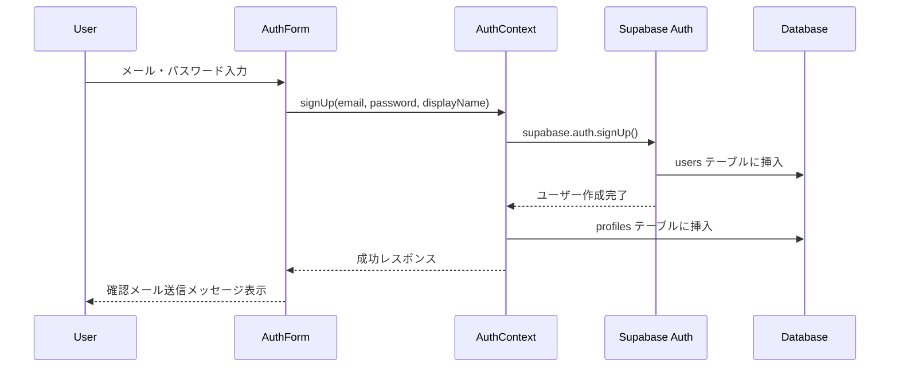
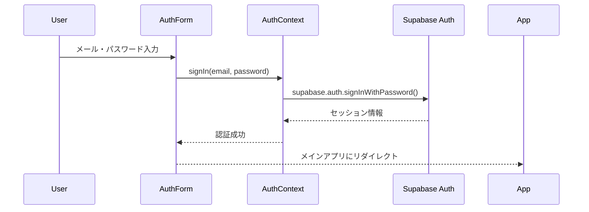
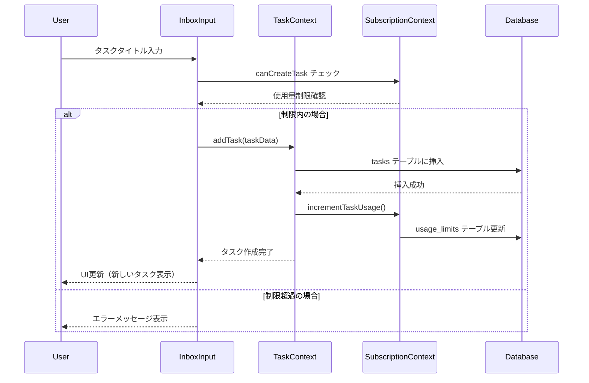
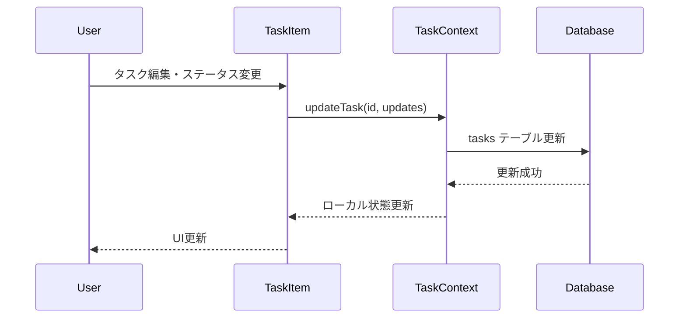
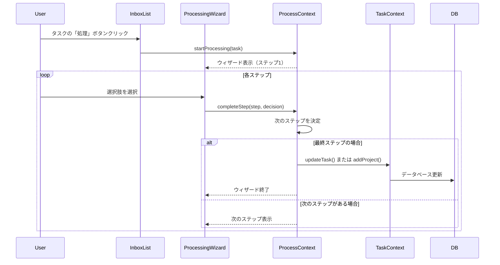
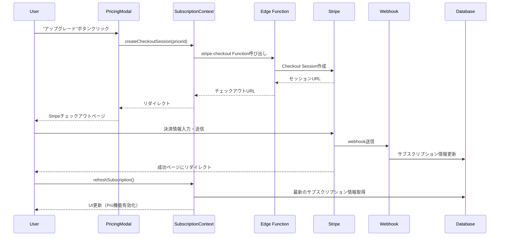
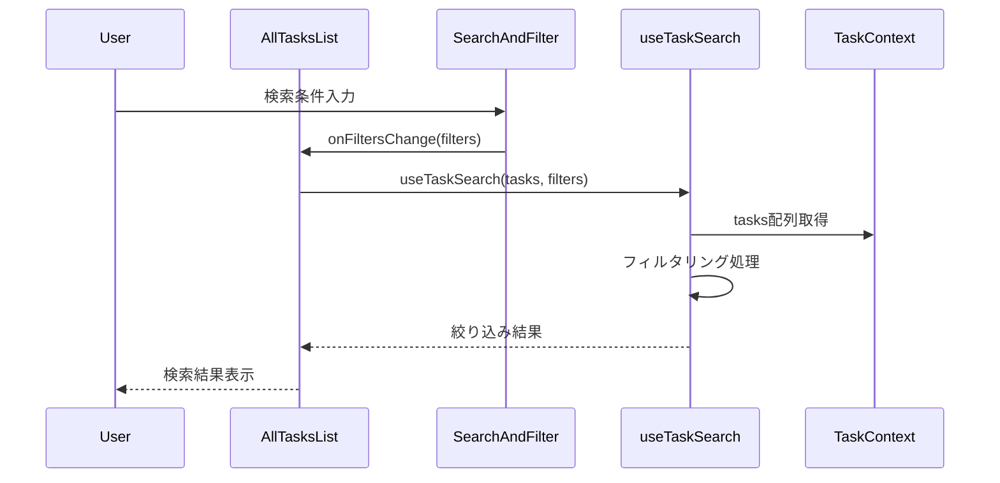
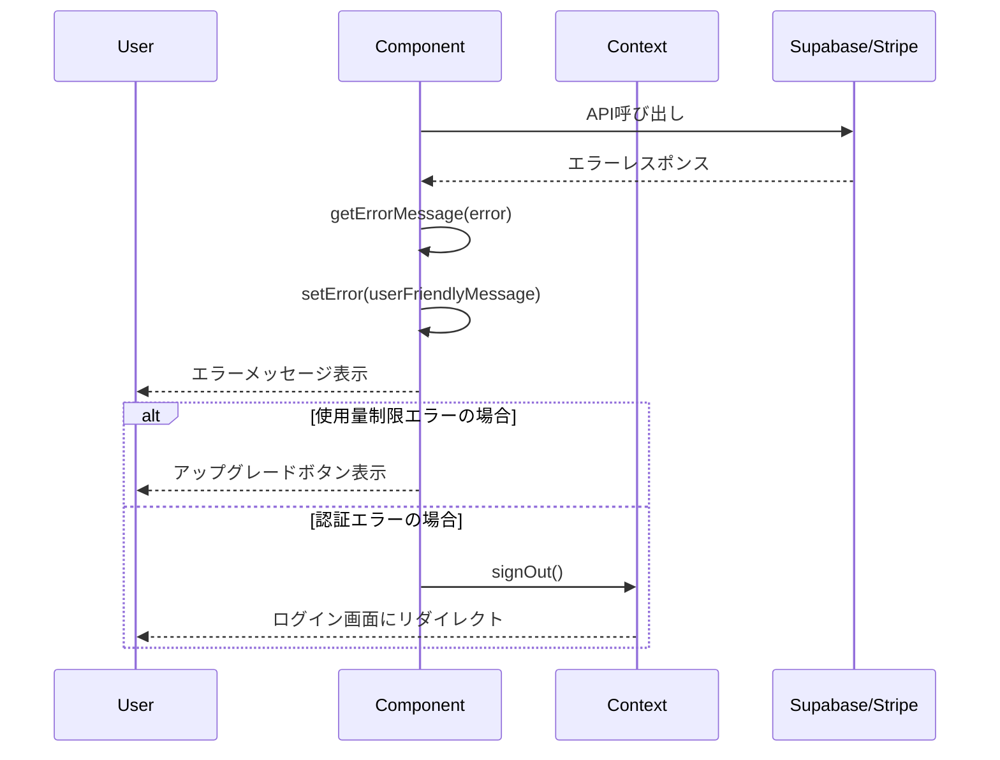
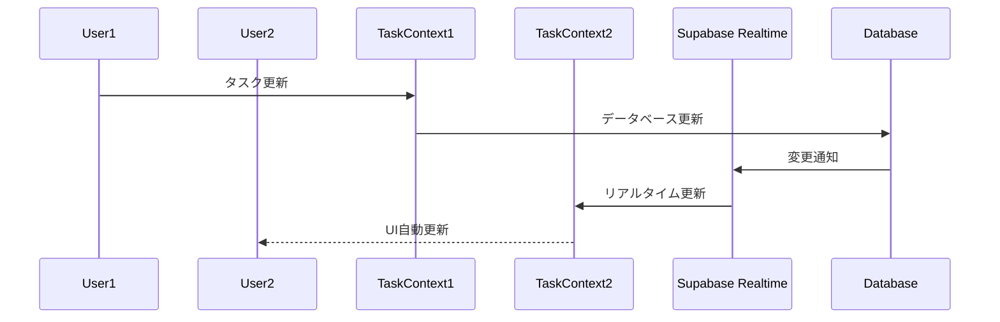
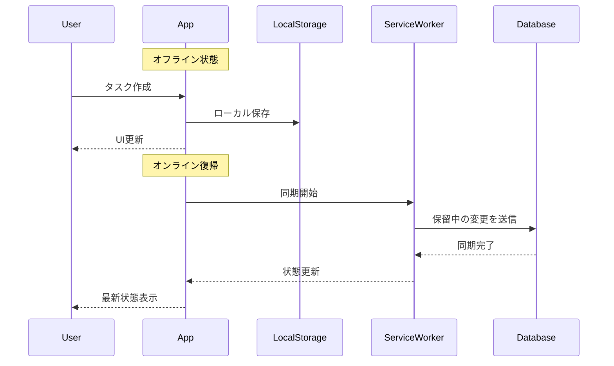

# データフロー図・シーケンス図

## 概要

Focus Flowアプリケーションにおける主要なユースケースのデータフローとシーケンスを詳細に説明します。

## 1. ユーザー認証フロー

### サインアップシーケンス



### サインインシーケンス



## 2. タスク管理フロー

### タスク作成フロー



### タスク更新フロー



## 3. GTD処理ワークフロー

### インボックス処理シーケンス



### GTD決定フロー

```
ステップ1: それは何か？
    ↓
ステップ2: 行動が必要か？
    ├─ No → 参考資料 / いつか/たぶん / 削除
    └─ Yes
        ↓
ステップ3: 複数ステップか？
    ├─ Yes → プロジェクト作成
    └─ No
        ↓
ステップ4: 2分以内でできるか？
    ├─ Yes → 即座に完了
    └─ No
        ↓
ステップ5: 委任できるか？
    ├─ Yes → 待ち項目
    └─ No
        ↓
ステップ6: 特定の日に実行？
    ├─ Yes → 予定済み
    └─ No → 次のアクション
```

## 4. サブスクリプション管理フロー

### アップグレードシーケンス



## 5. 検索・フィルタリングフロー

### 検索実行フロー



## 6. エラーハンドリングフロー

### エラー処理パターン



## 7. リアルタイム更新フロー（将来実装）

### Supabase Realtime連携



## 8. オフライン対応フロー（将来実装）

### オフライン同期



## データ整合性の保証

### 1. 楽観的更新

- UI を即座に更新
- バックエンドエラー時にロールバック

### 2. 競合解決

- タイムスタンプベースの競合解決
- ユーザーへの競合通知

### 3. トランザクション管理

- 関連データの一貫性保証
- 部分的失敗時のロールバック

## パフォーマンス監視

### 1. メトリクス

- ページロード時間
- API レスポンス時間
- エラー率
- ユーザーエンゲージメント

### 2. 監視ツール

- Supabase Analytics
- ブラウザ Performance API
- カスタムメトリクス収集

## セキュリティデータフロー

### 1. 認証トークンフロー

```
ログイン → JWT取得 → ローカル保存 → API呼び出し時にヘッダーに付与 → 
サーバーサイド検証 → RLSポリシー適用 → データアクセス制御
```

### 2. 権限チェックフロー

```
ユーザーアクション → フロントエンド権限チェック → API呼び出し → 
バックエンド権限チェック → RLSポリシー → データベースアクセス
```