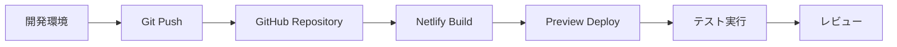
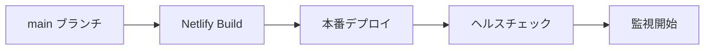

# デプロイメントアーキテクチャ設計書

## 概要

Focus Flowアプリケーションの本番環境デプロイメントアーキテクチャについて詳細に説明します。

## アーキテクチャ概要図

```
┌─────────────────┐    ┌──────────────────┐    ┌─────────────────┐
│                 │    │                  │    │                 │
│   Netlify CDN   │    │   Supabase       │    │     Stripe      │
│                 │    │                  │    │                 │
│  ┌───────────┐  │    │  ┌─────────────┐ │    │  ┌───────────┐  │
│  │ React App │  │    │  │ PostgreSQL  │ │    │  │ Payments  │  │
│  │ (Static)  │  │    │  │ Database    │ │    │  │ API       │  │
│  └───────────┘  │    │  └─────────────┘ │    │  └───────────┘  │
│                 │    │                  │    │                 │
│  ┌───────────┐  │    │  ┌─────────────┐ │    │  ┌───────────┐  │
│  │   CDN     │  │    │  │    Auth     │ │    │  │ Webhooks  │  │
│  │ (Assets)  │  │    │  │   Service   │ │    │  │           │  │
│  └───────────┘  │    │  └─────────────┘ │    │  └───────────┘  │
│                 │    │                  │    │                 │
└─────────────────┘    │  ┌─────────────┐ │    └─────────────────┘
                       │  │ Edge        │ │
                       │  │ Functions   │ │
                       │  └─────────────┘ │
                       │                  │
                       └──────────────────┘
```

## コンポーネント詳細

### 1. Netlify (フロントエンド)

**役割**: 静的サイトホスティング、CDN、ビルド自動化

**設定**:
```yaml
# netlify.toml
[build]
  command = "npm run build"
  publish = "dist"

[build.environment]
  NODE_VERSION = "18"

[[redirects]]
  from = "/*"
  to = "/index.html"
  status = 200

[[headers]]
  for = "/*"
  [headers.values]
    X-Frame-Options = "DENY"
    X-Content-Type-Options = "nosniff"
    Referrer-Policy = "strict-origin-when-cross-origin"
```

**環境変数**:
- `VITE_SUPABASE_URL`
- `VITE_SUPABASE_ANON_KEY`

**特徴**:
- 自動HTTPS
- グローバルCDN
- 継続的デプロイメント
- プレビューデプロイメント

### 2. Supabase (バックエンド)

#### 2.1 PostgreSQL Database

**役割**: メインデータストレージ

**主要テーブル**:
- `users`: ユーザー情報
- `profiles`: ユーザープロファイル
- `tasks`: タスクデータ
- `projects`: プロジェクトデータ
- `usage_limits`: 使用量制限
- `stripe_customers`: Stripe顧客情報
- `stripe_subscriptions`: サブスクリプション情報

**セキュリティ**:
- Row Level Security (RLS) 有効
- ユーザー別データ分離
- 暗号化ストレージ

#### 2.2 Auth Service

**役割**: ユーザー認証・認可

**機能**:
- メール/パスワード認証
- JWT トークン発行
- セッション管理
- パスワードリセット

**設定**:
- メール確認: 無効（開発用）
- 自動確認: 有効
- セッション期限: 24時間

#### 2.3 Edge Functions

**役割**: サーバーサイドロジック実行

**Functions**:

1. **stripe-checkout**
   - **場所**: `/functions/v1/stripe-checkout`
   - **役割**: Stripe Checkout セッション作成
   - **実行環境**: Deno Runtime
   - **依存関係**: Stripe SDK

2. **stripe-webhook**
   - **場所**: `/functions/v1/stripe-webhook`
   - **役割**: Stripe webhook処理
   - **実行環境**: Deno Runtime
   - **セキュリティ**: Webhook署名検証

**環境変数**:
- `STRIPE_SECRET_KEY`
- `STRIPE_WEBHOOK_SECRET`
- `SUPABASE_URL`
- `SUPABASE_SERVICE_ROLE_KEY`

### 3. Stripe (決済処理)

**役割**: サブスクリプション決済処理

**設定**:
- 商品: 無料プラン、ベーシックプラン（¥500/月）
- 決済方法: クレジットカード
- 通貨: JPY（日本円）

**Webhook設定**:
- エンドポイント: `https://[project-id].supabase.co/functions/v1/stripe-webhook`
- イベント:
  - `checkout.session.completed`
  - `customer.subscription.created`
  - `customer.subscription.updated`
  - `customer.subscription.deleted`
  - `invoice.payment_succeeded`
  - `invoice.payment_failed`

## デプロイメントフロー

### 1. 開発からステージング



### 2. 本番デプロイメント



### 3. Edge Functions デプロイ

```bash
# Supabase CLI使用
supabase functions deploy stripe-checkout
supabase functions deploy stripe-webhook
```

## 環境構成

### 開発環境

```
Local Development
├── Vite Dev Server (localhost:5173)
├── Supabase Local (optional)
└── Stripe Test Mode
```

### ステージング環境

```
Netlify Preview
├── Preview URL
├── Supabase Staging Project
└── Stripe Test Mode
```

### 本番環境

```
Netlify Production
├── Custom Domain
├── Supabase Production Project
└── Stripe Live Mode
```

## セキュリティ設定

### 1. HTTPS/TLS

- **Netlify**: 自動HTTPS証明書
- **Supabase**: TLS 1.2以上
- **Stripe**: TLS 1.2以上必須

### 2. CORS設定

```typescript
const corsHeaders = {
  'Access-Control-Allow-Origin': '*',
  'Access-Control-Allow-Methods': 'GET, POST, PUT, DELETE, OPTIONS',
  'Access-Control-Allow-Headers': 'Content-Type, Authorization',
}
```

### 3. セキュリティヘッダー

```
X-Frame-Options: DENY
X-Content-Type-Options: nosniff
Referrer-Policy: strict-origin-when-cross-origin
Content-Security-Policy: default-src 'self'
```

## 監視・ログ

### 1. アプリケーション監視

**Netlify**:
- ビルド状況
- デプロイメント履歴
- アクセス統計

**Supabase**:
- データベースパフォーマンス
- API使用量
- エラーログ

### 2. ログ収集

**フロントエンド**:
- ブラウザコンソールエラー
- ユーザーアクション追跡
- パフォーマンスメトリクス

**バックエンド**:
- Edge Function実行ログ
- データベースクエリログ
- 認証ログ

### 3. アラート設定

- API エラー率閾値
- レスポンス時間閾値
- データベース接続エラー
- 決済処理エラー

## スケーラビリティ

### 1. 水平スケーリング

**Netlify**:
- グローバルCDN
- 自動スケーリング

**Supabase**:
- 自動データベーススケーリング
- Edge Functions自動スケーリング

### 2. パフォーマンス最適化

**フロントエンド**:
- コード分割
- 画像最適化
- キャッシュ戦略

**バックエンド**:
- データベースインデックス
- クエリ最適化
- 接続プーリング

## バックアップ・災害復旧

### 1. データバックアップ

**Supabase**:
- 自動日次バックアップ
- ポイントインタイムリカバリ
- 地理的冗長化

### 2. 復旧手順

1. **データベース復旧**
   - Supabaseダッシュボードから復旧
   - 特定時点への復元

2. **アプリケーション復旧**
   - Netlifyでの前バージョンへのロールバック
   - 緊急時の手動デプロイ

## コスト最適化

### 1. Netlify

- **無料枠**: 月100GB帯域幅
- **Pro**: 月$19（必要に応じて）

### 2. Supabase

- **無料枠**: 月500MB、50,000 API呼び出し
- **Pro**: 月$25（本格運用時）

### 3. Stripe

- **手数料**: 3.6%（国内カード）
- **月額費用**: なし

## CI/CD パイプライン

### 1. 自動テスト

```yaml
# GitHub Actions例
name: CI/CD
on: [push, pull_request]
jobs:
  test:
    runs-on: ubuntu-latest
    steps:
      - uses: actions/checkout@v2
      - uses: actions/setup-node@v2
      - run: npm install
      - run: npm run lint
      - run: npm run test
      - run: npm run build
```

### 2. デプロイメント自動化

- **main ブランチ**: 自動本番デプロイ
- **develop ブランチ**: 自動ステージングデプロイ
- **feature ブランチ**: プレビューデプロイ

## 運用手順

### 1. 定期メンテナンス

- **週次**: ログ確認、パフォーマンス監視
- **月次**: セキュリティアップデート
- **四半期**: 依存関係更新

### 2. 緊急時対応

1. **サービス停止時**
   - ステータスページ更新
   - ユーザー通知
   - 原因調査・修復

2. **セキュリティインシデント**
   - 影響範囲特定
   - 緊急パッチ適用
   - ユーザー通知

### 3. スケールアップ手順

1. **トラフィック増加時**
   - Netlify Pro プランへアップグレード
   - Supabase Pro プランへアップグレード

2. **機能拡張時**
   - 新しいEdge Functions追加
   - データベーススキーマ更新
   - 段階的ロールアウト